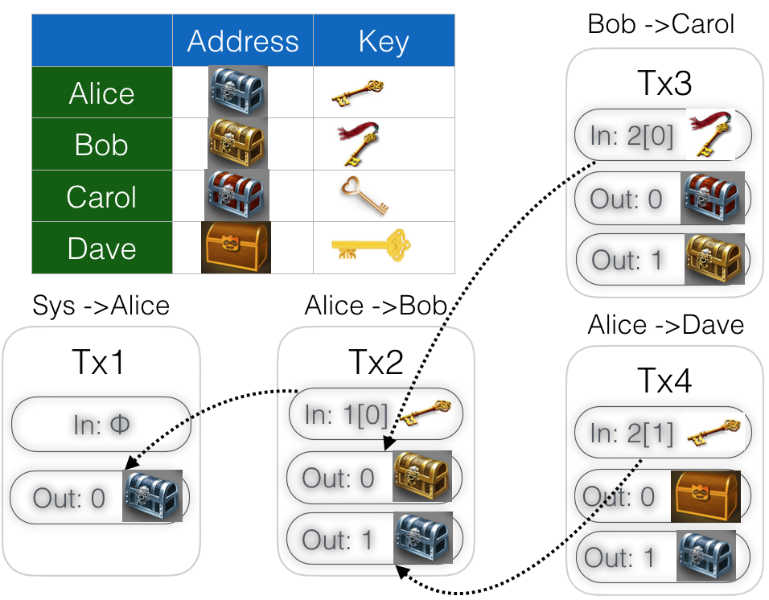

# 比特币交易
### 1 基于账户的记账

比特币的交易过程其实就是不停地创造区块的过程，每个块都有一个指向上一区块的哈希指针，所有经过确认的区块通过指针串联起来行程一个链（区块链），这个链即是比特币账簿不可篡改的基础。先看一下以账户为核心的记账方式：首先系统将创造的新币放在某人的账号，如Alice，然后这个Alice就可以给其它人转账了，如下图所示：


图1： An account-based ledger 图片来源：【1】

这样做的缺点时，如果某人想要确认一笔交易是否真实(如最后一笔不确认Alice的余额是否够)，就必须跟踪每一个账户余额，为了计算这个余额就必须找到所有与这个账户有关的交易，并加起来确认当时的余额，当然，也可以增加一个单独的字段，用来更新每次交易后的账户余额，但这也增加了记账的工作量。
比特币没有采用这种记账方式

### 2 基于交易的记账

图2中将基于账户的记账方式改为了基于交易的记账，每笔交易都有一个对无二的ID。这种记账方式每个中都至少有一个输入值和输出值（还可以有多个输出，输出从0开始编号），输入值是将被消耗掉的币（这些币是前一个交易创造出来的），输出值是本次交易中创造出来的币。对于铸造新币的交易，只会产生新币，而不会消耗任何旧币（所以这种交易只有输出，没有输入），下面详细解释一下图2的交易（图3是交易的另外一种示范图）：


图2： Transaction-based ledger 图片来源：【1】


图3： Transaction-based ledger


- 对于交易1， 是铸造新币的交易，输入为空，输出25个币到Alice的账户；

- 对于交易2， Alice想给Bob的账户转移17个，她必须明确这些币的来源，因此输入指向交易1的第一个输出，1[0]表示；另外，剩余的8个币转给Alice自己了（原因后面说明），当然这个交易必须由Alice签名；

- 对于交易3， Bob分别把8个币转给了Carol，这些币来源于第二个交易的第一个输出，即2[0]； 另外剩余的9个转给了Bob自己，交易由Bob签名；

- 对于交易4， Alice将账户中8个币中的6个转给了Dave，剩余的2个转给自己，这些币来源第一笔交易的第二个输出，即2[1]；交易由Alice签名；

比特币采用的就是这种类似的记账方式，但比特币在交易的输入输出中引入了脚本，使得交易更加灵活，后面会对脚本是如何运行的及对脚本的应用做进一步的描述

### 3 关于交易的其它几个内容

在进行后续的内容之前，先澄清几个概念

#### 3.1 地址转换

在比特币交易中，一个交易中输出的比币，要么在一个交易中被完全消费掉，要么就一个都不被消费，不存在只消费部分的情况。对于交易2，Alice的输入有25个币（来源于上一个交易的输出），但她只需付给Bob 17个币，那么剩余的8个币必须指定另外一个输出地址，但前提是这个地址为Alice所有，这就是地址转换。
(
`
注1： 这里不考虑费用问题，及费用为0；
注2： 其实这个就是找零机制，剩余币的输出地址不一定是Alice原来的地址，但生产新的地址可以由钱包控制，并保存私钥，这个私钥也归属于Alice，并且只能Alice使用。
`
)

#### 3.2 有效验证

对于新加入账本的交易，有效性总需要验证，在基于交易的账本中引入hash指针，可快速查找交易的引用。例如对于交易1确认Alice有25个币，且确认这些币还没有被花掉，我们只需要扫描交易指针引用所在的最新的block块，而不需要最终到起始block，而且这种方式不需要额外的数据结构（当然，我们将会看到额外的数据结构也会进一步提高速度）。

### 3.3 资金合并

这有点儿类似拿着零钱去银行换整钱，但其实在比特币系统中是对交易的合并，假如在Bob在两笔不同的交易中分别收到了17个币和2个币，他想在下一次交易中把这19个一起花掉，这很容易，他只需要发起一个交易，这个交易由两个输入，一个输出，输出的地址是Bob自己的，这种这两笔交易就合二为一了，在下一次交易中这19个币可以做为一个输入花掉。（当然，不提前合并也可以在下一笔交易中一起花掉，多个输入）。

### 3.4 共同支付

同样，共同支付也很容易做到，假设在某笔交易中Bob和Carol想一起支付给Dave，他们只需要发起一笔交易，交易由两个输入（分别来自Bob和Carol，来自于不同的地址）和一个输出（Dave的地址），这笔交易需要两个签名：Bob的和Carol的。

### 4 交易语法（结构）

在比特币网络上传输的数据都需要转换为二进制形式，为了便于人类易读，我们都已JSON形式展示，如下代码所示：

注： 该交易来自于著名的[Pizza Transaction](https://bitcointalk.org/index.php?topic=137.0)【2】，我们可也在链上找到这笔交易的[记录](https://webbtc.com/tx/cca7507897abc89628f450e8b1e0c6fca4ec3f7b34cccf55f3f531c659ff4d79)：

```json
{
  "hash": "cca7507897abc89628f450e8b1e0c6fca4ec3f7b34cccf55f3f531c659ff4d79",
  "ver": 1,
  "vin_sz": 1,
  "vout_sz": 2,
  "lock_time": 0,
  "size": 300,
  "in": [
    {
      "prev_out": {
        "hash": "a1075db55d416d3ca199f55b6084e2115b9345e16c5cf302fc80e9d5fbf5d48d",
        "n": 0
      },
      "scriptSig": "30450221009908144ca6539e09512b9295c8a27050d478fbb96f8addbc3d075544dc41328702201aa528be2b907d316d2da068dd9eb1e23243d97e444d59290d2fddf25269ee0e01042e930f39ba62c6534ee98ed20ca98959d34aa9e057cda01cfd422c6bab3667b76426529382c23f42b9b08d7832d4fee1d6b437a8526e59667ce9c4e9dcebcabb"
    }
  ],
  "out": [
    {
      "value": "5777.00000000",
      "scriptPubKey": "OP_DUP OP_HASH160 df1bd49a6c9e34dfa8631f2c54cf39986027501b OP_EQUALVERIFY OP_CHECKSIG",
      "address": "1MLh2UVHgonJY4ZtsakoXtkcXDJ2EPU6RY",
      "next_in": {
        "hash": "3b8328fe7e53a8162cf023738a53c85a3cbf21efe517ab878e8cfecc3a2e22db",
        "n": 0
      }
    },
    {
      "value": "4223.00000000",
      "scriptPubKey": "04cd5e9726e6afeae357b1806be25a4c3d3811775835d235417ea746b7db9eeab33cf01674b944c64561ce3388fa1abd0fa88b06c44ce81e2234aa70fe578d455d OP_CHECKSIG",
      "next_in": {
        "hash": "9e744590d196b63d02a1dd7ef596fd6082286f84295d66da411a9ffebfdd1957",
        "n": 10
      }
    }
  ],
  "nid": "1aed0e7cd223f973090d55da33a574312707d2cc4a4f4a5c70d6bbdc88b14cd1",
  "block": "0000000013ab9f8ed78b254a429d3d5ad52905362e01bf6c682940337721eb51",
  "blocknumber": 57044,
  "time": "2010-05-22 18:26:08"
}
```

从数据结构可以看，一个比特币交易分为三部分： 元数据、一系列输入和一系列输出：

- 元数据：
存放一些内部处理的信息，如这笔交易的规模（size）、输入的数量（vin_sz）、输出的数量（vout_sz）、版本号（ver）等，每一步交易都有一个唯一的ID，用交易的hash值表示（如何证明唯一性？），最后还有一个锁定时间，具体的用法在后面讨论。

- 输入：所有输入排成一个序列，每个输入的格式都是一样的。输入指向前一笔交易的输出（由前一笔交易的hash + 输出索引确定），同时还包括一个签名：这个签名来证明我们有资格去支配这笔比特币。

- 输出：所有输出也排成一个序列，同时包含了一个隐含的索引（输出序列中的位置，由0开始）。所有输出结构也相同，只包含输出金额和特定的公钥地址（scriptPubKey)。所有输出之和必须小于等于输入之和，输入金额与输出金额之间的差额部分将作为交易费奖励给为这笔交易记账的矿工。

### 5 比特币的脚本

#### 5.1 什么是脚本

每笔交易的输出中不是直接指定了一个公钥地址，而是指定了一段特殊的脚本。那么什么是脚本及为什么要使用脚本？脚本是比特币的工作控制语言，与FORTH(一种编译语言)一样，脚本是简单的、基于堆栈的、并且从左向右处理，它特意设计成非图灵完整，没有LOOP语句，后面将通过示例解释一下脚本的执行过程。
最常见的比特币交易，就是通过某人的签名去取得他在前一笔交易中获得的资金。交易的输输入脚本中只是指定了一个公钥的签名（或是公钥hash值的地址），那么谁来验证这个公钥签名的正确性呢？答案就是上一笔交易的输出脚本。换个角度来理解，假设Alice给Bob转了一笔钱，Alice只知道Bob签名的地址，这个地址我们可以理解为Bob的一个宝箱，Alice把要支付的币放在了这个宝箱中并设定一个咒语（宝箱加上咒语可以输出脚本），这个咒语的答案只有Bob知道如何生成的（通过私钥签名，输入脚本），如果Bob想使用宝箱里的币，他必须提供咒语的答案，根据这个答案，程序会验证这个答案是否和咒语匹配（执行脚本），如果匹配，Bob就可以从宝箱里拿到币，否则就无法拿到。如下图所示：



图4： Transaction-based ledger

我们可以看到，当前交易的输入脚本和上一笔交易的输出脚本串联起来，这个串联的脚本必须被执行成功后才能获取资金，这两个脚本一个输出脚本（scriptPubKey)，另一个是输入脚本（scriptSig）（另外还有一种叫法是当前交易的输入脚本是解锁脚本，对应交易的输出脚本叫锁定脚本）。

#### 5.2 脚本指令

脚本语言十分简单，只有256个指令，每个指令只占一个字节，256个指令中有15个目前不可用，有75个被保留还没具体定义，剩下的就是可用。下表给出的是比特币系统常用的指令：

表1 常用脚本指令及功能


一个实际输出脚本（scriptPubKey）范例，脚本指令从左向右依次执行:
```
OP_DUP
OP_HASH160
46af3fb481837fadbb421727f9959c2d32a36829
OP_EQUALVERIFY
OP_CHECKSIG
```

#### 5.3 执行脚本

前面接受了脚本相关的内容，接下来实际演示一下将输入和输出脚本串联起来并执行的过程。前面的Pizza Transaction中有一个输入部分，如下：
```json
"in": [
  {
    "prev_out": {
      "hash": "a1075db55d416d3ca199f55b6084e2115b9345e16c5cf302fc80e9d5fbf5d48d",
      "n": 0
    },
    "scriptSig": "30450221009908144ca6539e09512b9295c8a27050d478fbb96f8addbc3d075544dc41328702201aa528be2b907d316d2da068dd9eb1e23243d97e444d59290d2fddf25269ee0e01042e930f39ba62c6534ee98ed20ca98959d34aa9e057cda01cfd422c6bab3667b76426529382c23f42b9b08d7832d4fee1d6b437a8526e59667ce9c4e9dcebcabb"
  }
]
```
这个输入部分指明上一笔交易的hash（a1075db55d416d3ca199f55b6084e2115b9345e16c5cf302fc80e9d5fbf5d48d）及一个输出脚本（scriptSig），根据上一笔交易的hash可以找到上一笔交易，根据索引号（这里为0）可以找到具体的输出，如下：

```json
{
  "hash": "a1075db55d416d3ca199f55b6084e2115b9345e16c5cf302fc80e9d5fbf5d48d",
  "ver": 1,
  "vin_sz": 131,
  "vout_sz": 1,
  "lock_time": 0,
  "size": 23620,
  "in": [],
  "out": [
    {
      "value": "10000.00000000",
      "scriptPubKey": "OP_DUP OP_HASH160 46af3fb481837fadbb421727f9959c2d32a36829 OP_EQUALVERIFY OP_CHECKSIG",
      "address": "17SkEw2md5avVNyYgj6RiXuQKNwkXaxFyQ",
      "next_in": {
        "hash": "cca7507897abc89628f450e8b1e0c6fca4ec3f7b34cccf55f3f531c659ff4d79",
        "n": 0
      }
    }
  ],
  "nid": "efd36a68b4e99b5f1506922676404a12a75912fb3005845777a146d750937971",
  "block": "00000000152340ca42227603908689183edc47355204e7aca59383b0aaac1fd8",
  "blocknumber": 57043,
  "time": "2010-05-22 18:16:31"
}
```

OK，现在有了输入和输出脚本，接下来就模拟一下这两个脚本串联后在堆栈里执行流程，为了便于操作模拟，我们用几个变量替代脚本中实际的值，并用<>括起来表示，另外，指令生成的数据用()括起来表示，对于输出脚本中的一串怪怪的字符串46af...6829(公钥的hash值)用<pubKeyHash>代替，输出脚本中只有一长串字符3045...cabb，没有操作指令，这个长串是由签名和公钥组成的，分别用<sig>和<pubKey>表示，进过上述改造后串联起来的脚本如下所示（为便于阅读，进行了分行）：

```
<sig>
<pubKey>
---------- # 分割线实际不存在，分割线上面是输入脚本，下面是输出脚本
OP_DUP
OP_HASH160
<pubKeyHash>
OP_EQUALVERIFY
OP_CHECKSIG
```
对于堆栈语言的脚本，我们只需要一个堆栈并将存入（push）和取出（pop）数据，而不需要其他内存或变量。脚本里的指令分为两种：一种是数据指令，碰到数据指令，直接将该数据压入栈顶即可，另外一种是工作指令，会对栈顶数据做为输入参数并执行一些操作。我们用下图演示逐一执行上述脚本指令时堆栈的变化情况：


执行步骤说明：
* 1. <sig>： 数据指令，直接入栈
* 2. <pubKey>： 数据指令，直接入栈
* 3. OP_DUP： 工作指令，复制栈顶数据，生成数据(pubKey)并入栈
* 4. OP_HASH160： 工作指令，弹出栈顶数据(pubKey)并进行hash运算得到(pubKeyHash)并入栈
* 5. <pubKeyHash>： 数据指令，直接入栈
* 6. OP_EQUALVERIFY： 工作指令，依次弹出栈顶数据<pubKeyHash>和(pubKeyHash)，检查这两个数据是否相等，如果不相等，就会抛出一个失败信号，并且停止执行脚本，这里我们得到相等的结果，继续执行后面的指令。
* 7. OP_CHECKSIG：工作指令，现在堆栈只剩下两个数据公钥<pubKey>和签名<sig>，该指令用公钥来验证整个交易的签名是否是真实的。这里我们的执行结果为“真”，栈变为空栈，表示这个交易是有效的。

花了点儿时间做了一个演示动画：

图4 脚本执行动态演示


另外，还有一个视频播放，见 execution-of-a-Bitcoin-script.m4v.zip

### 6. Q&A
#### 6.1 输入脚本中签名<sig> 到底是对什么东西的签名？
这个还有点儿晕，需要继续研究：
[资源1](https://bitshuo.com/topic/584e487763baf1df6cad0d91)
#### 6.2 脚本的应用有哪些？
TODO： 后续补
### 7. 参考：

【1】 [《Bitcoin and Cryptocurrency Technologies: A Comprehensive Introduction》](http://bitcoinbook.cs.princeton.edu/)
【2】 [Bitcoin Pizza Day](https://en.bitcoin.it/wiki/Laszlo_Hanyecz)
【3】 [深入理解比特币交易的脚本](https://www.liaoxuefeng.com/article/001482718603696a6b6eb2bebc74211ab967146a952ae0c000)
